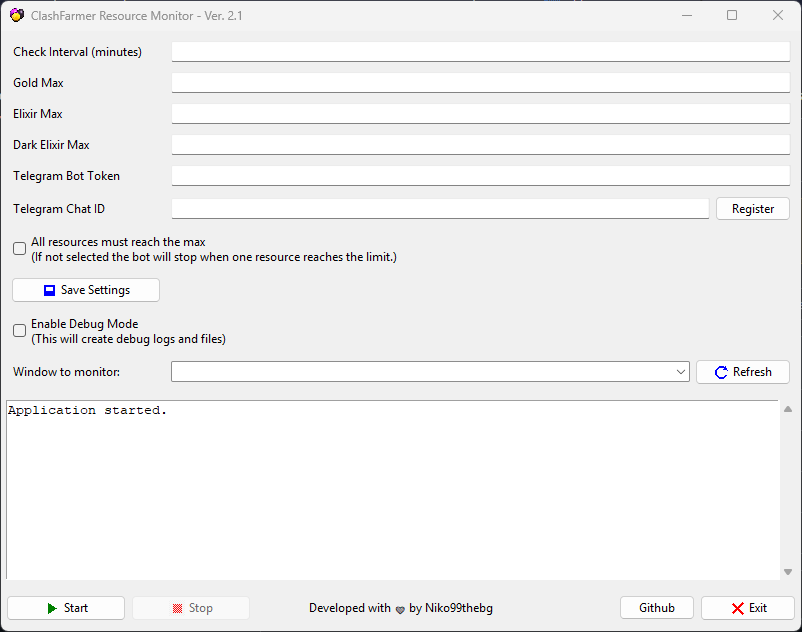

# ClashFarmer Resource Monitor

A Python GUI application that monitors your resource levels in ClashFarmer using screen OCR, and stops the bot automatically when resource limits are reached. Telegram notifications are sent when limits are triggered.

 <!-- Optional: add screenshot image -->

---

## Features

- 🪄 Automatically reads Gold, Elixir, and Dark Elixir via OCR
- ⏱️ Custom check interval (in minutes)
- 🔄 Dynamically scans and lists open windows to monitor
- 🛑 Option to stop when *any* or *all* resources reach their max
- 📬 Sends a Telegram message when stopping
- 🤖 Auto-detects your Telegram chat ID with a button
- 🖱️ Clicks the **"Stop Bot"** button in the ClashFarmer GUI using AutoHotKey
- 🔍 Optional debug mode with saved OCR image and text output
- 💾 Settings saved and restored via `config.json`
- 🖼️ Clean, simple GUI built with `tkinter`, includes icon buttons

---

## Requirements

- *(Optional)* **Python 3.12** (if you want to run main.py and not the exe)
- **Tesseract OCR** installed and added to PATH  
  _(Directory: `C:\Program Files\Tesseract-OCR`)_  
  👉 [Download Tesseract](https://github.com/tesseract-ocr/tesseract)

- **AutoHotKey** (used to click the "Stop Bot" button)  
  _(Directory: `C:\Program Files\AutoHotkey`)_  
  👉 [Download AutoHotKey](https://www.autohotkey.com/)

---

## Installation

1. **Download the latest release:**

   👉 Go to the [Releases section](https://github.com/Niko99thebg/public_clashfarmer_resourcemonitor/releases)  
   and download the latest `ClashFarmerMonitor.exe` file.

2. **Run** `ClashFarmerMonitor.exe`  
   > It will create a `config.json` file with your settings.

3. **Fill in the required fields** in the GUI:  
   - `Gold`, `Elixir`, `Dark Elixir` max values  
   - `Interval` in minutes  
   - *(Optional)* Telegram bot token and chat ID for notifications

4. **Select** the ClashFarmer window from the dropdown list.

5. *(Optional)* Click **"Save Settings"** to persist your configuration.

6. Click **Start** to begin monitoring.

> ⚠️ **Important:** Always run the application as **Administrator** to ensure proper window interaction and AHK click functionality.

---

## Telegram Integration

To receive Telegram alerts:

1. Create a bot via [@BotFather](https://t.me/BotFather)
2. Copy your bot token and paste it into the GUI
3. Click **"Register"** next to the "Telegram Chat ID" field  
   to automatically detect your ID by sending a message to the bot

---

## Configuration

All settings are saved in a file called `config.json`.  
You can manage your configuration via the GUI.

- ✅ Settings are persistent between runs
- 💾 Click **"Save Settings"** in the GUI to write changes to `config.json`

---

## Debug Mode

Enable the **Debug Mode** checkbox to:

- Save the cropped OCR image as `debug_crop.png`
- Save raw OCR text to `debug_text.txt`
- See more detailed logs in the GUI

This is useful for troubleshooting OCR recognition or window capture issues.

---
## Known issues
- "Stop" button is being partially covered by the "Developed ..." text in certain resolutions
---

## License

This project is licensed under the [Apache License 2.0](https://www.apache.org/licenses/LICENSE-2.0).

You are free to use, modify, and distribute this software for personal or commercial use,  
as long as you include proper attribution and comply with the terms of the license.

---

## Disclaimer

This tool interacts with ClashFarmer and uses OCR automation.  
Use at your own risk. I am not affiliated with [Clash of Clans](https://supercell.com/en/games/clashofclans/) or [ClashFarmer](https://www.clashfarmer.com).

---

## Author

Developed with ❤️ by [Niko99thebg](https://github.com/Niko99thebg)
